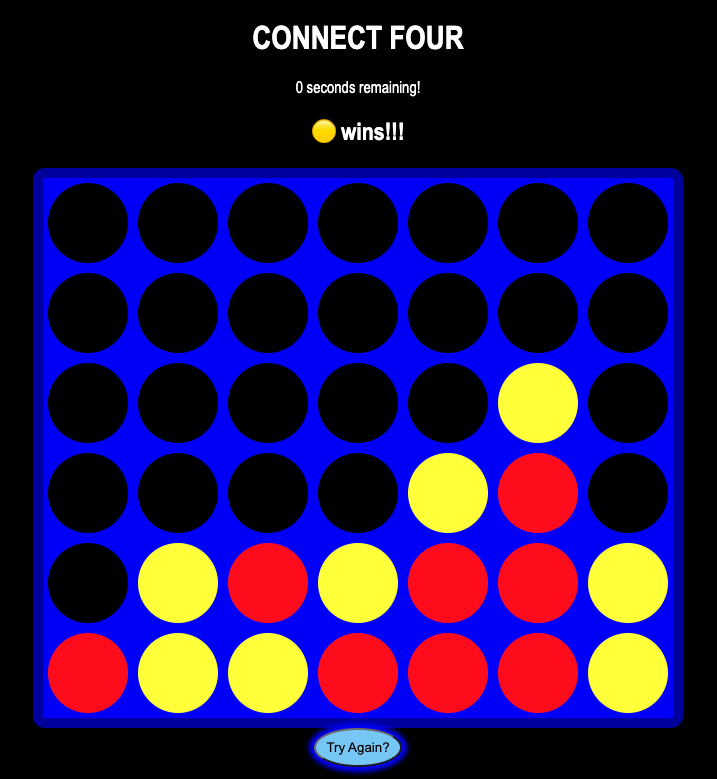

# This is Connect Four!

This is a recreation of the classic Connect-Four game.  Drop the tokens into any of the four columns with your red or yellow tokens. The goal of the game is to match four of the player's colored tokens either horizontally, diagonally, or vertically.  You can set up strategies to prevent your oppenent from completing their token combination.  There's a slight catch, there's a 10 second timer that starts immediately and resets every turn.  Make your moves carefully! If both players are unable to get four tokens and reach the very top of the board, the game ends in a tie!  You can always start the game over by pressing the 'Try Again?' button below the board.

## [Play the game here!](https://rm-connectfour.netlify.app/)

## Technologies used 💾

 
## Attributions
  Favicon created in Favicon.io.  
  Sound clip recorded from [discokingmusic via Freesound](https://freesound.org/people/discokingmusic/sounds/271387/)

## Recent Changes 🧹
- Added a 10 second timer.

## Ice Box 🧊
-[X] Add functionality for users to drop their tokens to the bottom of the board.

-[X] Font Design

-[X] Sound

-[X] Reset button

-[X] Timer for quick strategies

-[] Confetti for the winner of the game

-[] Accessibility to choose multiple token color options

-[] NPC algorithm to play against the computer